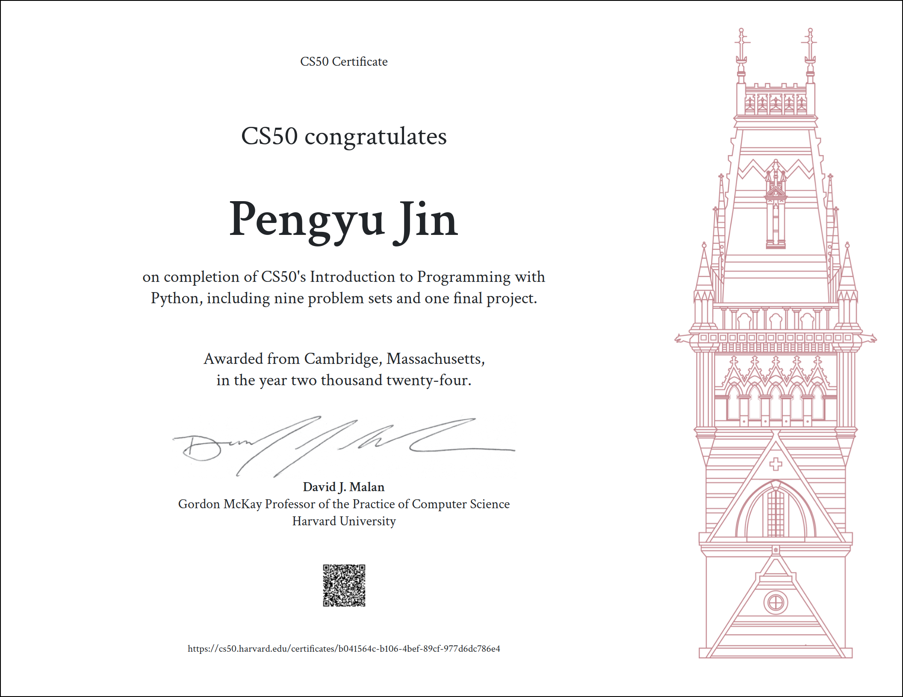

# CS50’s Introduction to Programming with Python

### These are my solutions for CS50's Introduction to Programming with Python 2022.Just for information.

### 🏠Course Website: [CS50P 2022](https://cs50.harvard.edu/python/2022/)

### 🎥Recordings: [CS50P 2022](https://youtu.be/OvKCESUCWII?si=Lq2KWHk9dcAILexT)

## My Final Project

### **🎬Video Demo**: [CS50P Final Project: Extract metadata from Instagram -- Youtube](https://youtu.be/jN7Ah_TUM7c?si=xyjxMQSYxOg_SG3b)

### **💻Presentation**: [CS50P Final Project Presentation](./pdf_collection/CS50P_final_project.pdf)

### **🎉Certificate**: 

## Disclaimer:

### ⚠️**The codes in this repository are for educational purpose only and not intended to be used / submitted as your own solutions.**

### ⚠️**Cheating violates the [Academic Honesty](https://cs50.harvard.edu/python/2022/honesty/) of the course, not to mention it's totally pointless if you actually want to learn programming.**

