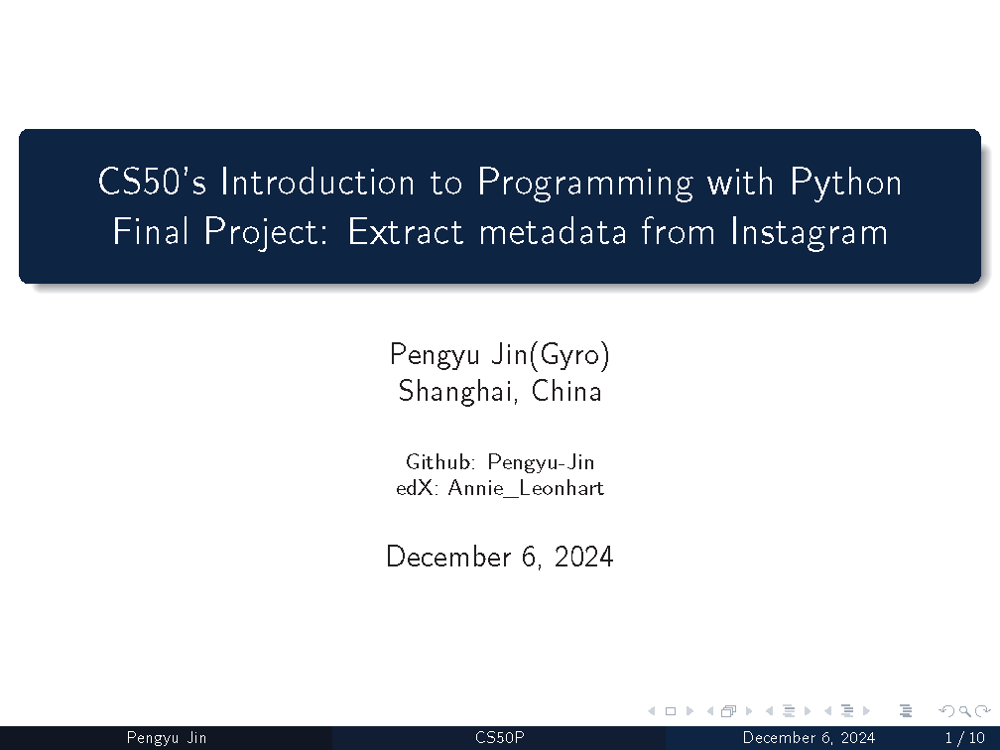
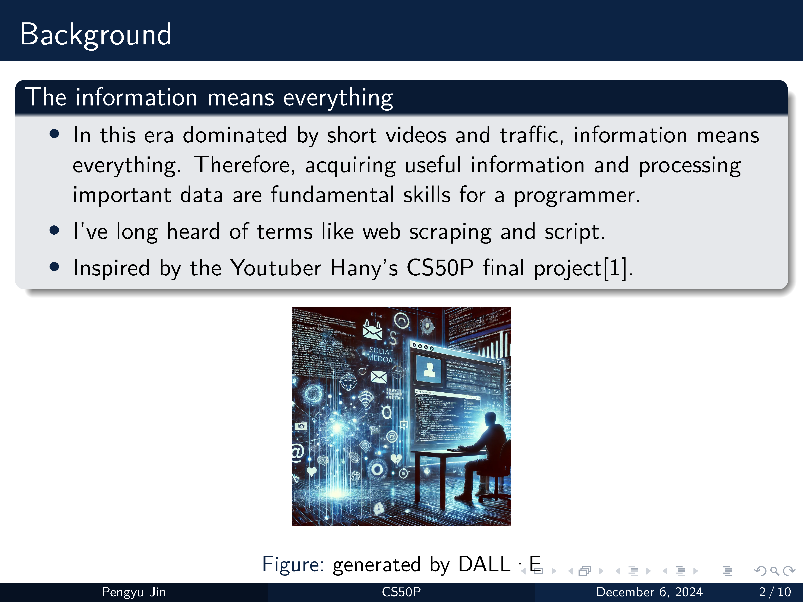
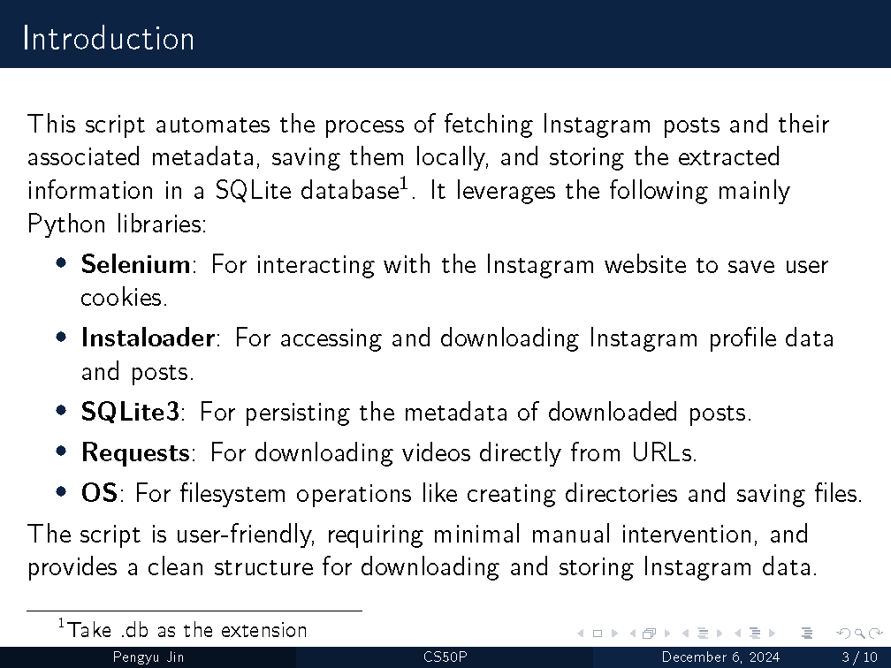

# CS50’s Introduction to Programming with Python

These are my solutions for CS50's Introduction to Programming with Python 2022.

Course Website: [CS50P 2022](https://cs50.harvard.edu/python/2022/){:target="_blank"}
Recordings: [CS50P 2022](https://youtu.be/OvKCESUCWII?si=Lq2KWHk9dcAILexT){:target="_blank"}

# My Final Project

**Video Demo**: [CS50P Final Project: Extract metadata from Instagram](https://youtu.be/jN7Ah_TUM7c?si=xyjxMQSYxOg_SG3b){:target="_blank"}

**Presentation**: 

**Certificate**:
...

